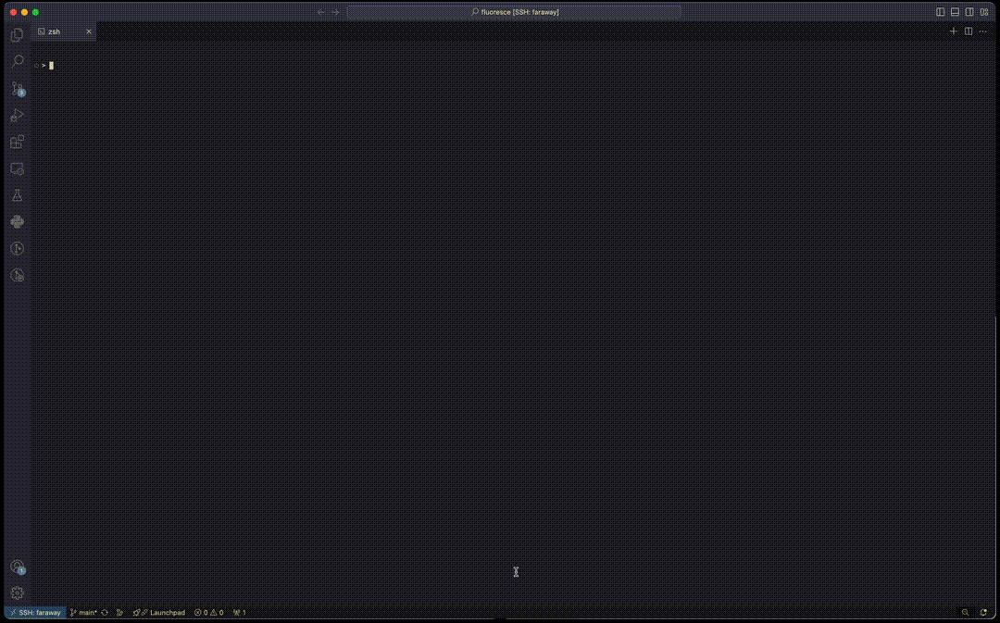

# Fluoresce



An in-terminal line-by-line debugger and memory inspector.


## Tutorial

To get started, clone the repository and install the pip dependencies, and install `clang` and `gdb`

```
$ pip install -r requirements.txt
$ sudo apt install -y clang gdb
```

The `GDB` class contains a set of asynchronous methods that represent either actual GDB commands or use actual GDB commands to gather useful information.

```python
# main.py

from asyncio import run, create_task
from contextlib import suppress
from pprint import pp

from gdb import GDB
from spark import spark, Foreground, Misc


async def main():
    async def log_reader(gdb: GDB):
        async for message in gdb.out_of_band_messages():
            print(spark(message, [Misc.faint, Foreground.blue]))

    async def output_reader(gdb: GDB):
        async for output in gdb.target_output():
            print(spark(f">>> {output}", [Misc.bold, Foreground.green]))

    async with GDB("target.c") as gdb:
        create_task(log_reader(gdb))
        create_task(output_reader(gdb))

        functions = await gdb.functions()
        print(f"found functions: {functions}")
        for function in functions:
            print(f"breakpoint no. {await gdb.breakpoint(function)} added")
        pp(await gdb.run())

        try:
            while True:
                await gdb.next()
                res = await gdb.traverse()
                print(spark(f"Info at report!", [Foreground.bright_yellow]))
                pp(res)
        except AssertionError as e:
            if "No registers." not in str(e):
                raise e


if __name__ == "__main__":
    with suppress(KeyboardInterrupt):
        run(main=main())
```

Once you've finished, save the file and run it with Python.

```
python3.13 main.py
```

All done! You should see the GDB module in action in the terminal.


To use the frontend, execute the `fluoresce.py` file with the C language source to debug.

```
python3.13 fluoresce.py target.c
```

# Method Reference

- `gdb.functions()`: get a list of functions
- `gdb.breakpoint(function)`: set a breakpoint at the function
- `gdb.run()`: sets the inferior process to begin running
- `gdb.next()`: executes the next line in the inferior proces
- `gdb.frames()`: get a list of current stack frames
- `gdb.variables(frame?)`: get a dict of variables for this frame
- `gdb.variable_info(variable, frame?)`: get the type, value, address, and children for a variable
- `gdb.traverse()`: get a detailed view of local variables and memory
- `gdb.out_of_band_messages()`: asynchronously iterate over GDB MI's out-of-band records
- `gdb.traget_output()`: asynchonously iterate over inferior process's output
